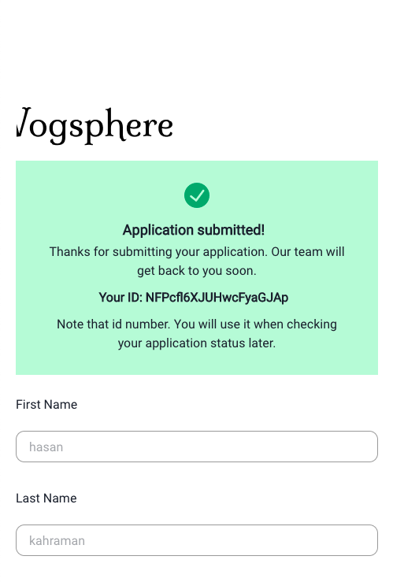

<h1 align="center">
  
  <br>
</h1>
<p align="center" style="font-size: 1.2rem;">This is an app that you can apply for citizenship to our planet. You can also check your application status in the same app. And there is an admin panel in the app. We will view your application in this panel.  </p>

> [Live Link 💗](https://planetofvogsphere.vercel.app) |
> [Design files](https://www.figma.com/file/1z4r5NnzzEKMgGp3SdXcEA/Vogsphere?node-id=0%3A1) |
> [More info about Vogsphere](https://scifi.fandom.com/wiki/Vogsphere)

## Some Screen From App

  <div>
  
  
  </div>
  <div>
  
  
  
  
  </div>

## Installation

- Clone the the repo.
- Install the dependencies.
- Run `yarn run start`.
- You need a firebase project. Create a project [here](https://firebase.google.com)
- After create a project, create a .env file like this
- `REACT_APP_FB_API_KEY="api key"`
- `REACT_APP_FB_AUTH_DOMAIN="auth domain"`
- `REACT_APP_FB_PROJECT_ID="project id"`
- `REACT_APP_FB_STORAGE_BUCKET="storage bucket"`
- `REACT_APP_FB_MESSAGING_SENDER_ID="messagigng sender id"`
- `REACT_APP_FB_APP_ID="app id"`
- `REACT_APP_FB_MEASUREMENT_ID="measurement id"`
- Do no forget the firesbase edit rules.
- In your firebase database > rules > add this line `allow read, write: if true;`

## Usage

- You can easily create an application.
- If you want to login admin page use these:
- username `kodluyoruz@kodluyoruz.com`
- password `bootcamp109`

## Folder Structure

```
src
┣ components
┃ ┣ App
┃   ┣ App.jsx
┃   ┣ App.css
┃   ┣ App.test.js
┃   ┣ index.jsx
┣ config
┣ contexts
┣ helpers
┣ hooks
┣ navigation
┣ pages
┣ services
┣ styles
```

- All components are in the components folder.
- There is a `index.js` file in the components folder. And exported all components in this file. Like this:
- `export * from './App';`
- `export * from './Cover';`
- `export * from './HelperText';`
- `export * from './Sidebar';`
- After this index file you can import components like this
- `import { App, Cover, HelperText } from 'components'`

## Hooks

- useToggle
  > It takes a parameter with value true or false and toggles that value to opposite. I used this toggle open and close navigation sidebar.
- useWindowSize
  > For to get the current size of the browser window. Used for close sidebar in a condition.

## Tech Stack

- Starter Kit - [create react app](https://create-react-app.dev)
- Component Library - [chakra-ui](https://chakra-ui.com)
- Form - [react-hook-form](https://react-hook-form.com)
- Validation - [yup](https://github.com/jquense/yup)
- Eslint - [airbnb config](https://github.com/airbnb/javascript/tree/master/packages/eslint-config-airbnb)
- Test - [react testing library](https://testing-library.com/docs/react-testing-library/intro/)
- [Firebase](https://firebase.google.com)
